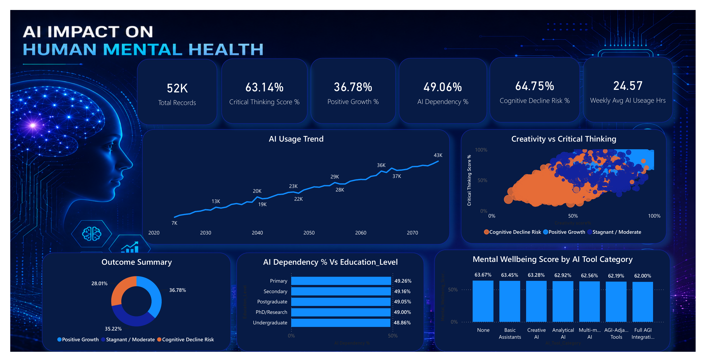
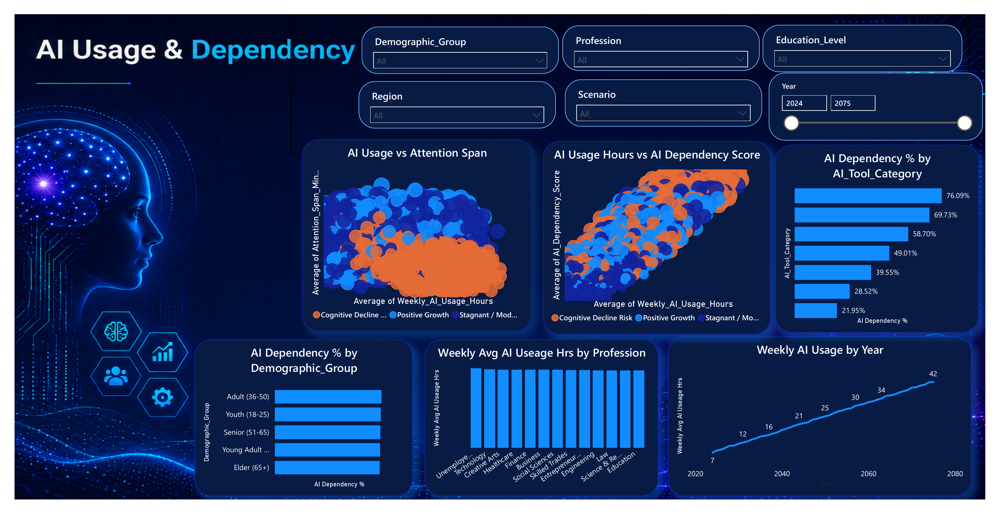
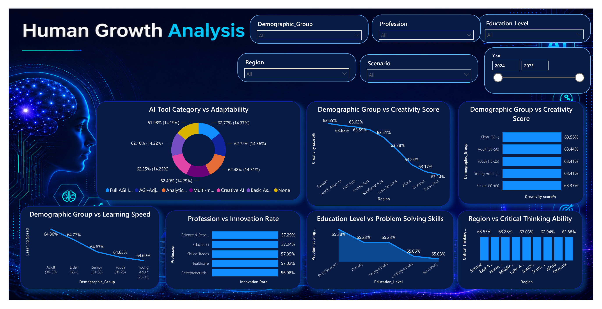
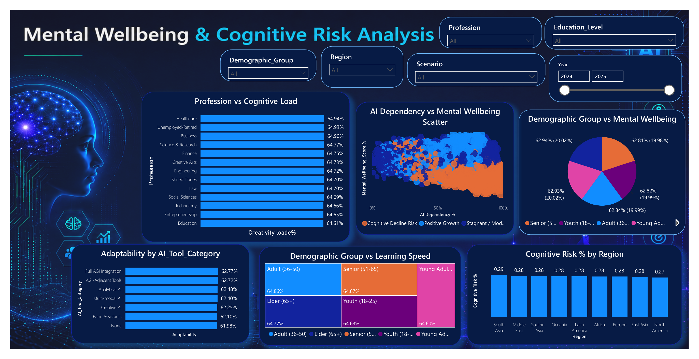

# AI Impact on Human Mental Health Dashboard


An interactive **Power BI dashboard** exploring how AI usage and dependency may relate to critical thinking, creativity, attention span, adaptability, learning speed, mental wellbeing, and cognitive-risk indicators across demographic groups, professions, education levels, regions, scenarios, and time periods.

> **Important:** This is an analytical portfolio project based on the supplied dataset. The dashboard identifies patterns and associations; it does not establish medical causation or provide clinical advice.

---

## Dashboard Preview



---

## Project Objective

The project was created to examine the possible impact of increasing AI usage on human mental growth and wellbeing. It transforms a large dataset into an interactive report that helps users:

- Track AI usage and dependency over time.
- Compare cognitive and wellbeing indicators across population groups.
- Explore relationships between AI usage, attention span, creativity, and critical thinking.
- Identify professions, regions, and education levels with different behavioral patterns.
- Evaluate positive-growth, stagnant/moderate, and cognitive-decline-risk outcomes.

---

## Headline KPIs

| Metric | Dashboard Value |
|---|---:|
| Total Records | **52K** |
| Critical Thinking Score | **63.14%** |
| Positive Growth | **36.78%** |
| AI Dependency | **49.06%** |
| Cognitive Decline Risk Score | **64.75%** |
| Weekly Average AI Usage | **24.57 hours** |

The outcome summary divides records into **Positive Growth (36.78%)**, **Stagnant / Moderate (35.22%)**, and **Cognitive Decline Risk (28.01%)** categories.

---

## Dashboard Pages

### 1. Overview Dashboard

Provides a high-level view of AI usage, cognitive outcomes, critical-thinking performance, dependency, and mental-wellbeing indicators.

Key visuals include:

- AI usage trend over time
- Creativity versus critical thinking
- Outcome summary
- AI dependency by education level
- Mental-wellbeing score by AI tool category


### 2. AI Usage & Dependency

Examines how AI usage hours connect with attention span and dependency scores. It also compares usage across professions, demographic groups, tool categories, and years.



### 3. Human Growth Analysis

Analyzes adaptability, creativity, learning speed, innovation rate, problem-solving ability, and critical-thinking performance across demographic, professional, education, and regional segments.



### 4. Mental Wellbeing & Cognitive Risk

Focuses on cognitive load, mental wellbeing, adaptability, learning speed, and regional cognitive-risk patterns. The page also explores the relationship between AI dependency and mental-wellbeing scores.



---

## Key Insights

- Average AI dependency is **49.06%**, while weekly AI usage averages **24.57 hours** in the dataset.
- Outcome distribution is relatively balanced, with positive growth slightly higher than stagnant/moderate and cognitive-decline-risk categories.
- AI dependency is consistent across education levels, ranging from approximately **48.86% to 49.26%**.
- Mental-wellbeing scores show a small decline across increasingly advanced AI tool categories, from **63.67%** for no AI usage to **62.00%** for full AGI integration.
- Adaptability is highest for **Full AGI Integration (62.77%)** and lowest for **None (61.98%)**, although the overall variation is limited.
- Creativity scores remain close across demographic groups, ranging from approximately **63.37% to 63.56%**.
- **Science & Research** and **Education** show the highest innovation rates among the displayed professions.
- Regional cognitive-risk values are closely grouped, approximately between **0.27 and 0.29**.

These results should be interpreted as descriptive findings within the project dataset rather than proof that AI usage directly causes a specific mental-health or cognitive outcome.

---

## Interactive Filters

The report supports analysis using the following slicers:

- Demographic Group
- Profession
- Education Level
- Region
- Scenario
- Year range

These filters allow users to move from a broad overview to focused comparisons between specific groups and time periods.

---

## Tools and Skills Demonstrated

- **Power BI Desktop**
- Interactive dashboard development
- KPI and report-page design
- Data visualization and comparison
- Trend, demographic, and behavioral analysis
- Scatter plots, donut charts, bar charts, line charts, and treemaps
- Business storytelling and insight communication
- User-friendly filtering and report navigation

---

## Repository Structure

```text
AI-Impact-on-Human-Mental-Health/
│
├── README.md
├── assets/
│   ├── overview-dashboard.png
│   ├── ai-usage-dependency.png
│   ├── human-growth-analysis.png
│   └── mental-wellbeing-cognitive-risk.png
│
└── docs/
    └── AI_Impact_on_Human_Mental_Health_Dashboard.pdf
```

---

## How to View the Project

1. Open the images in the `assets` folder to preview each dashboard page.
2. Open the PDF in the `docs` folder for the complete report.
3. Use the original Power BI file, when included in the repository, to interact with slicers and visuals.

---

## Possible Future Enhancements

- Add comparisons between low, medium, and high AI-usage groups.
- Include statistical testing or correlation summaries.
- Add drill-through pages for profession and region-level analysis.
- Introduce tooltips explaining each cognitive and wellbeing indicator.
- Compare historical and future scenarios more explicitly.
- Publish an interactive version through Power BI Service.

---

## Author

**Disha Dhingra**  
Data Analyst | Power BI | SQL | Python | Advanced Excel

- GitHub: [disha2093](https://github.com/disha2093)
- LinkedIn: [Disha Dhingra](https://www.linkedin.com/in/disha-dhingra2003/)

---

## Disclaimer

This project is intended for learning, portfolio presentation, and exploratory data analysis. The data and future scenarios may be synthetic or modeled. The dashboard is not a medical assessment tool and should not be used to diagnose, treat, or predict an individual's mental-health condition.

---

### Support

If you found this project useful, consider giving the repository a **star**.
